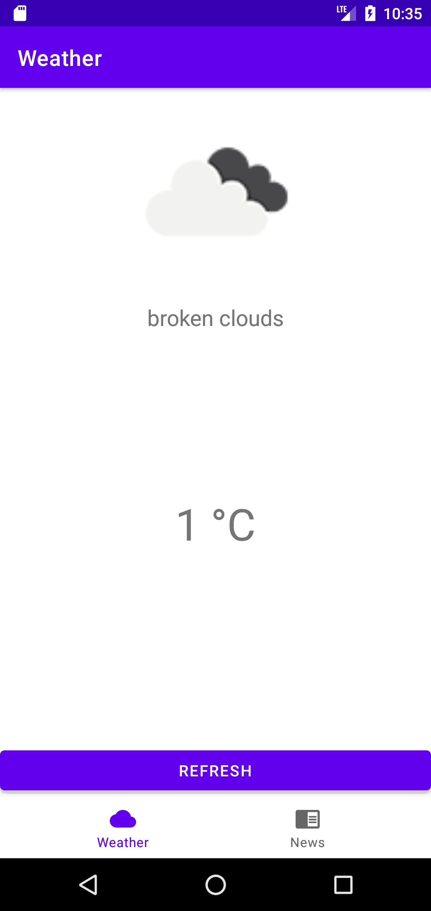
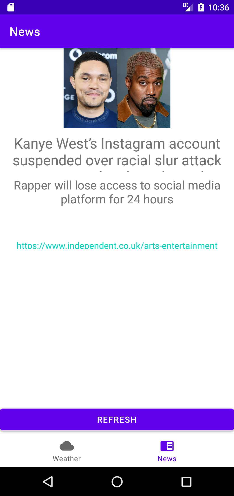

# Daily Assistant Android App
### An utility made for people who want a no-nonsense daily briefing with a focus on utmost simplicity.

This is an attempt to make use of API calls in order to deliver information to users.

### APIs used:
https://newsapi.org/ 
https://openweathermap.org/
 
 
 
<table>
<tr>
<td></td>
<td></td>
</tr>
</table>
